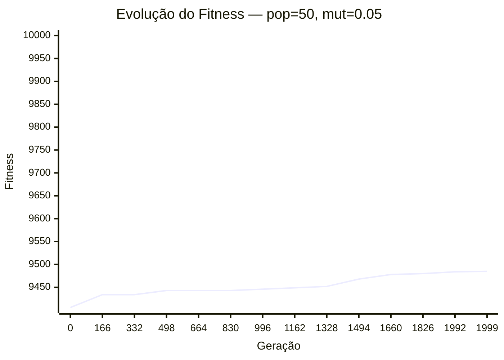
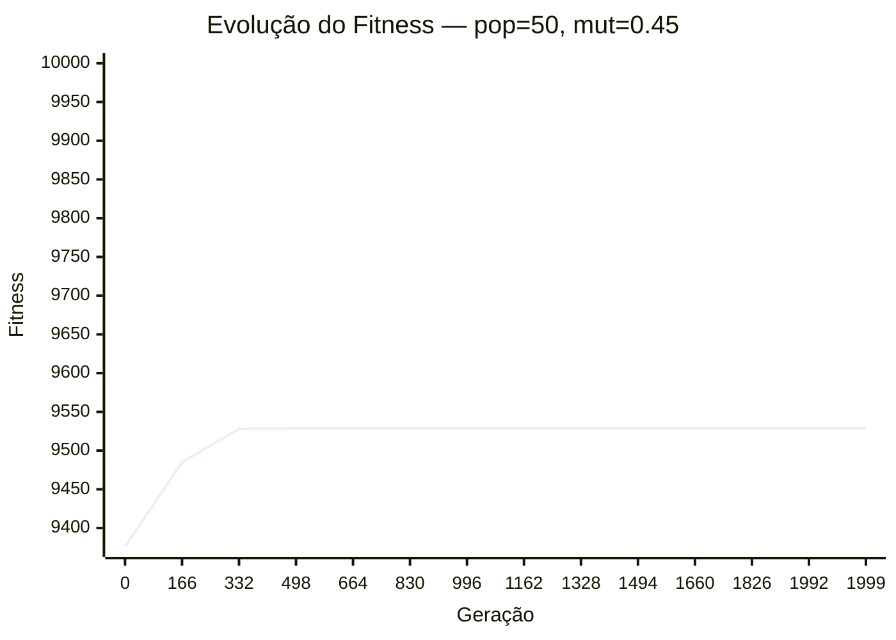
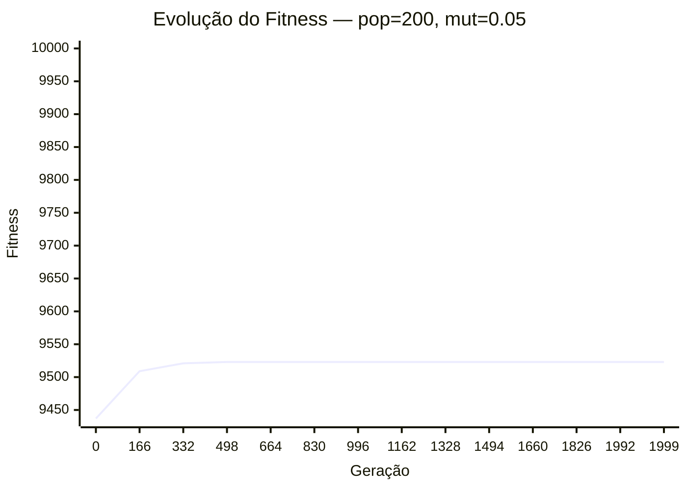
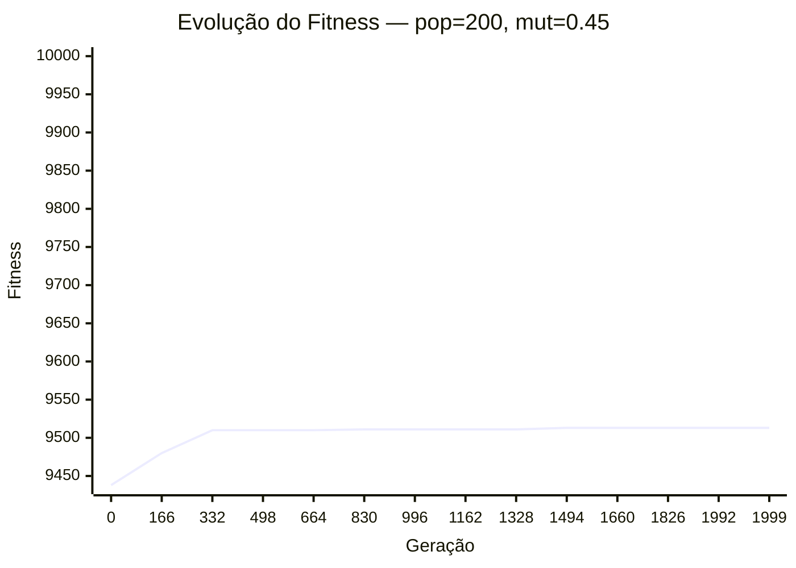

# Estudo de Hiperparâmetros

Este documento foi gerado automaticamente através de testes empíricos do algoritmo genético.

| Experimento | População | Mutação | Melhor Fitness | Convergência (Ger.) | Violações |
| :--- | :---: | :---: | :---: | :---: | :---: |
| População Baixa + Mutação Baixa | 50 | 0.05 | 9485.32 | 1997 | 0 |
| População Baixa + Mutação Alta | 50 | 0.45 | 9529.14 | 385 | 0 |
| População Alta + Mutação Baixa | 200 | 0.05 | 9523.35 | 810 | 0 |
| População Alta + Mutação Alta | 200 | 0.45 | 9513.61 | 1851 | 0 |

## Gráficos de Convergência

### População Baixa + Mutação Baixa

### População Baixa + Mutação Alta

### População Alta + Mutação Baixa

### População Alta + Mutação Alta

